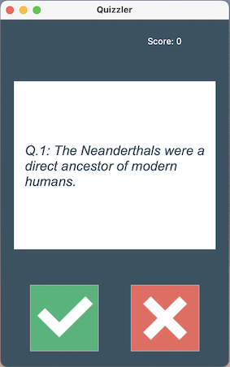

# Quiz-App
A quiz application created using Python and powered by the Open Trivia Database API allows users to enjoy interactive quizzes on various topics. This kind of application provides a fun and educational experience.

## Development Steps
**1. API Integration:** In [data.py](https://github.com/Ynsaaon/Quiz-App/blob/main/data.py) file, I use Python's requests library to interact with the Open Trivia Database API. Retrieve quiz questions that you can select from category and difficulty level.

**2. User Interface:** In [ui.py](https://github.com/Ynsaaon/Quiz-App/blob/main/ui.py) file, I create a user-friendly interface using a GUI library like Tkinter for desktop applications. Design the interface to display questions, answer options, and the user's score.

    

**3. Scoring Logic:** In [quiz_brain.py](https://github.com/Ynsaaon/Quiz-App/blob/main/quiz_brain.py) file, I implement the scoring logic to track the user's correct and incorrect answers. Calculate the total score based on their performance.

## Prerequisites
- Python - version 3.11.1
- tkinter Package

## Executing Output
- Clone this repo to your desktop and run `main.py` file on your Pycharm or VScode.
- If you want to change the question topic or difficulty level you can use this to guide [API_parameter](https://opentdb.com/api_config.php) and change the `parameters` in `data.py` file.